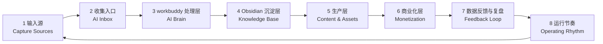

# 一人公司知识库 · 工作台

> **核心目标**:不是堆资料,而是让每条信息都能变成内容、资产或商业结果。
> **底层闭环**:输入 → 处理 → 沉淀 → 生产 → 变现 → 复盘 → 再输入。

---

## 📊 今日状态快照

每天开工第一件事:把数字填上,让状态可视化。

| 指标 | 数值 | 说明 |
|---|---|---|
| 🆕 新增 Inbox | ____ 条 | 昨天到今天丢进 `00_INBOX` 的素材 |
| 🧠 待 AI 处理 | ____ 条 | 还没过 workbuddy 的原始素材 |
| ✍️ 今日待产选题 | ____ 个 | 从 `02_KNOWLEDGE/选题库` 拉出 |
| 📣 今日发布平台 | ______ | 小红书 / 抖音 / 视频号 / B站 |
| 💰 今日变现 | ¥____ | 成交、咨询、课程等直接收入 |
| ⭐ 今日最重要 1 件事 | ______ | 只写一件,做完就算赢 |

---

## 🔄 8 步主流程(信息的一生)



---

## 🎯 模块快速入口

| 步骤 | 模块 | 一句话定位 | 入口 |
|---|---|---|---|
| 1 | **00_INBOX** | 所有信息无差别先丢进来 | [[00_INBOX/README\|打开]] · [[00_INBOX/_收件箱\|收件箱]] |
| 2 | **AI Inbox** | 统一入口,先收集不做深度整理 | 直接用 `00_INBOX/_收件箱` |
| 3 | **01_AI_BRAIN** | workbuddy 清洗/分类/结构化/摘要/关联/增强/商业标注 | [[01_AI_BRAIN/README\|打开]] |
| 4 | **02_KNOWLEDGE** | Obsidian 长期沉淀:选题/案例/方法/工具/用户问题/灵感/商业观察 | [[02_KNOWLEDGE/README\|打开]] |
| 5 | **03_CONTENT** | 内容生产:选题 → 脚本 → 文案 → 画面/B-roll → 封面 | [[03_CONTENT/README\|打开]] |
| 6 | **04_BUILD** | 商业化沉淀:课程/工具包/社群/企业咨询/SOP | [[04_BUILD/README\|打开]] |
| 7 | **05_OUTPUT** | 发布与数据复盘:小红书/抖音/视频号/B站 | [[05_OUTPUT/README\|打开]] |
| 8 | **06_SYSTEM** | 系统规则:个人定位/分类规则/Codex Prompt/运行节奏 | [[06_SYSTEM/README\|打开]] |

---

## ⚡ 今日动作清单

> 按时间块执行,做完就打勾。

- [ ] **早间 5 min** · 把昨天/今天所有素材丢进 [[00_INBOX/_收件箱\|_收件箱]](语音/截图/链接/复制)
- [ ] **上午 30 min** · 调用 [[06_SYSTEM/Codex-Prompt\|Codex Prompt]] 处理 Inbox → 沉淀到 `02_KNOWLEDGE`
- [ ] **中午 30 min** · 从 `02_KNOWLEDGE/选题库` 拉出 1-3 条,在 `03_CONTENT` 生产脚本/文案
- [ ] **晚间 20 min** · 发布到 `05_OUTPUT` 任一平台,并记录播放/点赞/评论/转化数据
- [ ] **周末 60 min** · 用 [[06_SYSTEM/数据复盘模板\|数据复盘模板]] 复盘,升级 [[06_SYSTEM/Codex-Prompt\|Prompt]] 与 [[06_SYSTEM/分类规则\|分类规则]]

---

## 📥 1 · 输入源捕获

**原则:先收集,不判断。** 看到任何有价值的信息,30 秒内保存下来。

| 来源 | 入口目录 | 保存方式 |
|---|---|---|
| 🎬 视频 / 播客 / 访谈 | `00_INBOX/视频-B站-YouTube/` | 链接 + 一句触发感想 |
| 📚 书籍 / 文章 / 笔记 | `00_INBOX/书籍-文章/` | 金句截图 + 原文位置 |
| 🔥 热点 / 行业新闻 | `00_INBOX/热点-行业新闻/` | 链接 + 为什么值得看 |
| 💡 灵感 / 随想 | `00_INBOX/灵感-随想/` | 语音 / 一句话 / 截图 |
| 📝 逐字稿 / 采访 | `00_INBOX/逐字稿-采访/` | 完整文本 |
| 🧰 项目经验 / 踩坑 | `00_INBOX/项目经验/` | 过程记录 |
| 💬 用户问题 / 私信 | `00_INBOX/用户问题-私信/` | 截图 + 原话 |
| 💼 客户 / 学员问题 | `00_INBOX/客户-学员/` | 原始记录 |
| 📊 数据 / 反馈 | `00_INBOX/数据反馈/` | 数字 + 截图 |

**统一入口**:所有当日素材集中到 [[00_INBOX/_收件箱\|_收件箱]],再批量交给 AI 处理。

---

## 🧠 2-3 · AI 处理入口

打开 [[06_SYSTEM/Codex-Prompt\|Codex Prompt]],按当前阶段选择模板:

1. **Inbox 清洗 + 分类** → 把 `_收件箱` 的素材变成结构化笔记
2. **摘要 / 切片** → 长素材切成钩子/口播/长图文
3. **选题 → 钩子** → 一个选题生成 5 种开头
4. **脚本生成** → 选题 → 完整脚本 + B-roll + 封面 + CTA
5. **改写多平台** → 一稿改小红书/公众号/知乎/朋友圈
6. **评论 / 互动话术** → 发布后前 30 分钟回应
7. **商业标注 / 产品建议** → 判断一条素材能变成什么产品
8. **数据复盘** → 周报/月报 + 下周选题建议

**调用前置(永远带上)**:[[06_SYSTEM/个人定位\|个人定位]] → 风格 → 任务。

---

## 🗂 4 · 沉淀层弹药库

这里是内容生产的弹药库,定期回看、补充、合并。

- [[02_KNOWLEDGE/选题库/_index\|选题库]] ← 内容从这里产生
- [[02_KNOWLEDGE/案例库/_index\|案例库]] ← 真实案例,让理论有血肉
- [[02_KNOWLEDGE/方法库/_index\|方法库]] ← 步骤 / 框架 / SOP
- [[02_KNOWLEDGE/工具库/_index\|工具库]] ← 工具测评 / 使用技巧
- [[02_KNOWLEDGE/用户问题库/_index\|用户问题库]] ← 高频提问决定选题方向
- [[02_KNOWLEDGE/灵感池/_index\|灵感池]] ← 金句 / 段子 / 故事钩子
- [[02_KNOWLEDGE/商业观察/_index\|商业观察]] ← 行业 / 竞品 / 商业模式

---

## ✍️ 5 · 生产层流水线

```
02_KNOWLEDGE/选题库/某选题.md
        ↓
03_CONTENT/脚本库/<平台>/YYYY-MM-DD_选题名.md
        ↓
03_CONTENT/文案库/YYYY-MM-DD_选题名.md
        ↓
03_CONTENT/画面-Broll/YYYY-MM-DD_选题名.md
        ↓
03_CONTENT/封面库/YYYY-MM-DD_选题名.md
```

**同一批知识,同时生产两种资产**:
- **内容资产**:短视频、图文、直播提纲、公众号文章
- **商业资产**:SOP、案例卡、交付文档、课程大纲、咨询方案

---

## 💰 6 · 商业化层

当某个选题/方法反复出现需求时,把它打包成产品。

| 产品形态 | 目录 | 触发条件 |
|---|---|---|
| 短视频 / 小红书落地 | `05_OUTPUT/` | 每次生产直接发布 |
| AI 工具包 / Prompt 合集 | `04_BUILD/工具包/` | 同一工具被问 ≥3 次 |
| 课程 / 训练营 | `04_BUILD/课程/` | 同一主题能讲满 3 节课 |
| 社群 / 会员 | `04_BUILD/社群/` | 用户愿意付费抱团 |
| 企业咨询 / 顾问服务 | `04_BUILD/企业咨询/` | B 端客户有明确需求 |
| SOP 沉淀 | `04_BUILD/SOP/` | 可复用的标准流程 |

**核心逻辑**:用户问题 → 内容验证 → 产品方案 → 成交转化。

---

## 📣 7 · 发布与数据复盘

发布即记录,没有数据的发布等于白做。

| 平台 | 发布目录 | 记录字段 |
|---|---|---|
| 小红书 | `05_OUTPUT/小红书/` | 播放 / 点赞 / 收藏 / 评论 / 转化 |
| 抖音 | `05_OUTPUT/抖音/` | 同上 |
| 视频号 | `05_OUTPUT/视频号/` | 同上 |
| B站 | `05_OUTPUT/B站/` | 同上 |

**当周数据看板**:

| 平台 | 本周发布数 | 爆款数(>X 赞) | 总播放 | 总转化 | 下周动作 |
|---|---|---|---|---|---|
| 小红书 | | | | | |
| 抖音 | | | | | |
| 视频号 | | | | | |
| B站 | | | | | |
| **合计** | | | | | |

> 爆款标准自己定(例如:小红书 ≥1000 赞,抖音 ≥1 万播放)。

---

## 🕐 8 · 运行节奏(Operating Rhythm)

```
收集输入 → AI Inbox → Codex 处理 → 产出 1-3 个选题 → 整理案例 → 建立双链/成交 → 更新模板与关联 → 盘点产出链条 → 优化知识结构 → 测试商业化价值
```

**稳定节奏 > 爆发冲刺**:
- 每天:输入 + 处理 + 生产/发布
- 每周:复盘 + 更新 Prompt + 选下周主推
- 每月:主题聚合 + 产品化判断 + 长期主义校准

详细时间表见 [[06_SYSTEM/每周节奏]] 与 [[06_SYSTEM/每日处理模板]]。

---

## 🛠 系统规则快捷入口

| 规则 | 作用 | 链接 |
|---|---|---|
| 个人定位 | 所有 AI 调用的"人设" | [[06_SYSTEM/个人定位\|打开]] |
| 分类规则 | 统一 3 层标签体系 | [[06_SYSTEM/分类规则\|打开]] |
| Codex Prompt | AI 处理模板库 | [[06_SYSTEM/Codex-Prompt\|打开]] |
| 每日处理模板 | 一天 5 段时间表 | [[06_SYSTEM/每日处理模板\|打开]] |
| 数据复盘模板 | 周末/月度复盘 | [[06_SYSTEM/数据复盘模板\|打开]] |
| 每周节奏 | 周历视图 | [[06_SYSTEM/每周节奏\|打开]] |
| 禁忌清单 | 永远不做的事 | [[06_SYSTEM/禁忌清单\|打开]] |
| 系统自检 | 周/月自检表 | [[06_SYSTEM/系统自检\|打开]] |
| 反馈循环 | 数据如何反哺系统 | [[06_SYSTEM/反馈循环\|打开]] |

---

## 🧹 一周清理动作(周末 60 min)

- [ ] 处理本周 `00_INBOX` 残留(没处理的扔 `99_ARCHIVE`)
- [ ] 从 `02_KNOWLEDGE/选题库` 选出下周主推 3 条
- [ ] 复盘 `05_OUTPUT` 数据,标出**爆款规律 / 失败规律**
- [ ] 更新 `06_SYSTEM/Codex-Prompt` 与 `02_KNOWLEDGE/方法库`
- [ ] 把"出现 ≥3 次的需求"打包进 `04_BUILD/`
- [ ] 跑一遍 [[06_SYSTEM/系统自检\|系统自检]]

---

## 🚀 一键启动(今天就开始)

1. 把此刻看到的任何素材丢进 [[00_INBOX/_收件箱\|_收件箱]]
2. 填好顶部的**今日状态快照**
3. 勾选**今日动作清单**里的第一项
4. 打开 [[06_SYSTEM/Codex-Prompt\|Codex Prompt]],开始处理
5. 从 `02_KNOWLEDGE/选题库` 拉一条选题,进 `03_CONTENT` 生产

> 你不是在整理知识,你是在搭建一个内容自动生产工厂。
