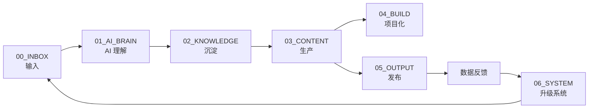

# 🧭 一人公司知识库 · 仪表盘

> 打开 Obsidian 时从这一页开始。这是你的指挥中心。

## 🚦 当前状态(自己填)

- **今日新增 Inbox:** 0 条
- **待处理 AI Brain 任务:** 0 条
- **本周已生产选题:** 0 个
- **本周已发布内容:** 0 条
- **本周变现:** ¥0

---

## 🔁 主流程(每条信息的一生)



---

## 📥 01 · 输入(`00_INBOX/`)

> **原则:先收集,不分类。无差别进 Inbox。**

| 来源 | 入口 | 日常动作 |
|---|---|---|
| 🎥 视频 / 播客 | `00_INBOX/视频-B站-YouTube/` | 看到立即扔链接 + 一句感想 |
| 📚 书籍 / 文章 | `00_INBOX/书籍-文章/` | 金句 + 章节定位 |
| 🔥 热点 / 新闻 | `00_INBOX/热点-行业新闻/` | 原文链接 + 触动点 |
| 💡 灵感 / 感悟 | `00_INBOX/灵感-随想/` | 语音 / 截图 / 一句话 |
| 📝 逐字稿 | `00_INBOX/逐字稿-采访/` | 文件 / 链接 |
| 🧰 项目经验 | `00_INBOX/项目经验/` | 项目过程笔记 |
| 💬 用户问题 / 学员提问 | `00_INBOX/用户问题-私信/` | 截图 + 原话 |
| 💼 客户 / 学员问题 | `00_INBOX/客户-学员/` | 原始记录 |
| 📊 数据 / 反馈 | `00_INBOX/数据反馈/` | 数字 + 截图 |

统一收集入口:`00_INBOX/_收件箱.md`(当日新素材一站集中)

📡 **自动输入**:Horizon 新闻雷达每天自动抓取 HN / RSS / Reddit / Telegram / Twitter / GitHub 并生成 AI 过滤后的每日简报 → 人工 5 分钟筛选进 `热点-行业新闻/`。详见 [[00_INBOX/_Horizon自动收集系统]]

---

## 🧠 02 · AI 理解(`01_AI_BRAIN/`)

打开 → [[01_AI_BRAIN/README]]

处理 7 步骤:
`清洗` → `分类` → `结构化(Markdown)` → `摘要(核心观点/步骤)` → `关联(双向链接)` → `增强(补充可复用见解)` → `商业标注(可用作 ?课 / ?工具 / ?种草)`

工具入口:[[06_SYSTEM/Codex-Prompt]]

---

## 🗂 03 · 沉淀(`02_KNOWLEDGE/`)

打开 → [[02_KNOWLEDGE/README]]

主题库清单:

- `02_KNOWLEDGE/选题库/` ← 从这里产出内容
- `02_KNOWLEDGE/案例库/` ← 真实案例反哺
- `02_KNOWLEDGE/方法库/` ← SOP / 框架
- `02_KNOWLEDGE/工具库/` ← 工具测评 / 使用技巧
- `02_KNOWLEDGE/用户问题库/` ← 知乎 / 小红书 / 学员的真实提问
- `02_KNOWLEDGE/灵感池/` ← 金句 / 段子 / 故事钩子
- `02_KNOWLEDGE/商业观察/` ← 行业 / 竞品 / 商业模式

---

## ✍️ 04 · 生产(`03_CONTENT/`)

打开 → [[03_CONTENT/README]]

```
选题 → 脚本 → 文案 → 画面 B-roll → 封面
       ↓
  03_CONTENT/选题库/
       ↓
  03_CONTENT/脚本库/<平台>/小红书|抖音|视频号|B站
       ↓
  03_CONTENT/文案库/
       ↓
  03_CONTENT/画面-Broll/
       ↓
  03_CONTENT/封面库/
```

---

## 🧱 05 · 项目化(`04_BUILD/`)

打开 → [[04_BUILD/README]]

```
03_CONTENT 中的爆款内容
    ↓ 反复出现的需求
  课程 / 训练营 (标准化交付)
  工具包 (Prompt / 模板合集)
  社群 (会员 / 知识星球)
  企业咨询 (B 端客单)
  SOP 沉淀 (用于 AI 自动生产)
```

---

## 📣 06 · 发布(`05_OUTPUT/`)

打开 → [[05_OUTPUT/README]]

```
03_CONTENT/脚本库/<平台>/... → 发布 → 05_OUTPUT/<平台>/YYYY-MM-DD_选题名.md
                                              ↓ 数据
                                         (播放/点赞/收藏/评论/转化)
                                              ↓
                                       06_SYSTEM/数据复盘
```

---

## ⚙️ 07 · 系统(`06_SYSTEM/`)

打开 → [[06_SYSTEM/README]]

- 个人定位
- 分类规则
- Codex Prompt
- 每日处理模板
- 数据复盘模板
- 每周节奏表

---

## 📊 当周复盘区

```dataview
TABLE
  平台 AS "平台",
  播放量 AS "播放",
  点赞 AS "点赞",
  转化 AS "转化"
FROM "05_OUTPUT"
WHERE 发布日期 >= date(today) - dur(7 days)
SORT 发布日期 DESC
```

> 如果 Dataview 没启用,可手动每周把数据复盘填入 `06_SYSTEM/数据复盘-YYYY-Wxx.md`

---

## 🧹 一周清理动作(周末 60 min)

- [ ] 处理本周 `00_INBOX` 残留(没处理的扔 `99_ARCHIVE`)
- [ ] 从 `02_KNOWLEDGE/选题库` 选出 3 条下周主推
- [ ] 复盘 `05_OUTPUT` 数据,标出**爆款规律 / 失败规律**
- [ ] 更新 `06_SYSTEM/Codex-Prompt` 与方法库
- [ ] 把"出现 ≥3 次的需求"打包进 `04_BUILD/`

---

> 💡 **下一步**:回到 [[README]],或任选一个模块下手。
